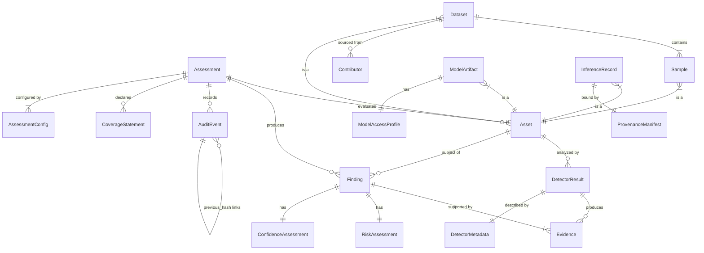

# PRAMAAN Data Model

> Domain entities, relationships, and persistence schema.

Version: 2.0-DRAFT  
Last Updated: 2026-09-10

---

## 1. Entity Relationship Overview



---

## 2. Core Entities

### Assessment

The top-level unit of work. One assessment evaluates one or more assets.

| Field | Type | Description |
|-------|------|-------------|
| `assessment_id` | UUID | Primary identifier |
| `assessment_type` | Enum | `LIVE` \| `DEMO` |
| `title` | str | Human-readable assessment name |
| `description` | str \| None | Optional context |
| `state` | Enum | `CREATED` → `INGESTING` → `ANALYZING` → `COMPLETE` → `FAILED` |
| `access_level` | Enum | Overall access level for this assessment |
| `config` | AssessmentConfig | Full configuration snapshot |
| `software_version` | str | PRAMAAN version at execution time |
| `configuration_hash` | str | SHA-256 of serialized config |
| `random_seed` | int \| None | For reproducibility |
| `environment` | EnvironmentInfo | Runtime environment details |
| `created_at` | datetime | UTC |
| `started_at` | datetime \| None | UTC |
| `completed_at` | datetime \| None | UTC |
| `error` | str \| None | Error message if `FAILED` |

### Asset

Anything submitted for evaluation.

| Field | Type | Description |
|-------|------|-------------|
| `asset_id` | UUID | Primary identifier |
| `assessment_id` | UUID | Parent assessment |
| `asset_type` | Enum | `DATASET` \| `MODEL` \| `IMAGE` \| `INFERENCE_BUNDLE` |
| `name` | str | Human-readable name |
| `file_path` | str | Path within evidence store |
| `sha256` | str | Content hash |
| `size_bytes` | int | File size |
| `format` | str | `COCO` \| `YOLO` \| `ONNX` \| `PYTORCH` \| `TORCHSCRIPT` \| `IMAGE_DIR` |
| `metadata` | dict | Format-specific metadata |
| `registered_at` | datetime | UTC |

### Dataset (extends Asset conceptually)

| Field | Type | Description |
|-------|------|-------------|
| `dataset_id` | UUID | = asset_id |
| `format` | str | `COCO` \| `YOLO` |
| `sample_count` | int | Total samples |
| `class_names` | list[str] | Label vocabulary |
| `annotation_path` | str \| None | Path to annotation file |
| `contributors` | list[ContributorRef] | Sources |

### Sample

Individual data point within a dataset.

| Field | Type | Description |
|-------|------|-------------|
| `sample_id` | UUID | Primary identifier |
| `dataset_id` | UUID | Parent dataset |
| `file_name` | str | Original filename |
| `sha256` | str | Image content hash |
| `phash` | str \| None | Perceptual hash (hex) |
| `dhash` | str \| None | Difference hash (hex) |
| `labels` | list[str] | Assigned labels |
| `contributor_id` | UUID \| None | Source attribution |
| `dimensions` | tuple[int, int] | Width × height |
| `file_size_bytes` | int | File size |

### Contributor

Source/origin of data samples.

| Field | Type | Description |
|-------|------|-------------|
| `contributor_id` | UUID | Primary identifier |
| `name` | str | Contributor name/identifier |
| `sample_count` | int | Samples from this contributor |
| `risk_summary` | RiskAssessment \| None | Aggregated risk |
| `flagged_sample_count` | int | Samples with findings |

### ModelArtifact (extends Asset conceptually)

| Field | Type | Description |
|-------|------|-------------|
| `model_id` | UUID | = asset_id |
| `framework` | str | `PYTORCH` \| `ONNX` \| `TORCHSCRIPT` |
| `architecture` | str \| None | Declared architecture (e.g., "ResNet-50") |
| `task_type` | str \| None | `CLASSIFICATION` \| `DETECTION` \| `SEGMENTATION` |
| `input_spec` | dict \| None | Expected input shape, dtype, normalization |
| `output_spec` | dict \| None | Expected output format |
| `sha256` | str | Model file hash |
| `access_profile` | ModelAccessProfile | Access level details |

### ModelAccessProfile

| Field | Type | Description |
|-------|------|-------------|
| `access_level` | Enum | `BLACK_BOX` \| `GRAY_BOX` \| `WHITE_BOX` |
| `has_weights` | bool | Can inspect raw parameters? |
| `has_architecture` | bool | Is architecture known? |
| `has_gradients` | bool | Can compute gradients? |
| `has_activations` | bool | Can extract intermediate activations? |
| `has_training_data` | bool | Is reference training data available? |
| `notes` | str \| None | Additional access information |

### InferenceRecord

| Field | Type | Description |
|-------|------|-------------|
| `record_id` | UUID | Primary identifier |
| `assessment_id` | UUID | Parent assessment |
| `model_id` | UUID | Model used |
| `input_asset_id` | UUID | Input image/data |
| `manifest` | ProvenanceManifest | Full provenance binding |
| `output_data` | dict | Actual inference output |

### ProvenanceManifest

See [ARCHITECTURE.md § Provenance Architecture](./ARCHITECTURE.md#6-provenance-architecture).

### Evidence

A discrete piece of evidence supporting a finding.

| Field | Type | Description |
|-------|------|-------------|
| `evidence_id` | UUID | Primary identifier |
| `finding_id` | UUID | Parent finding |
| `detector_id` | str | Which detector produced this |
| `evidence_type` | Enum | `MEASUREMENT` \| `COMPARISON` \| `ANOMALY` \| `HASH_MISMATCH` \| `STATISTICAL_TEST` \| `VISUALIZATION` |
| `description` | str | Human-readable description |
| `data` | dict | Structured evidence data (measurements, scores, etc.) |
| `artifact_path` | str \| None | Path to evidence artifact (image, report, etc.) |
| `artifact_hash` | str \| None | SHA-256 of the artifact file |

### Finding

An analyst-readable assessment conclusion.

| Field | Type | Description |
|-------|------|-------------|
| `finding_id` | str | Structured ID: `F-{category}-{seq}` |
| `assessment_id` | UUID | Parent assessment |
| `category` | Enum | `DATA_INTEGRITY` \| `MODEL_INTEGRITY` \| `INFERENCE_PROVENANCE` \| `DISTRIBUTION_DRIFT` \| `COVERAGE` |
| `subcategory` | str | Specific concern (e.g., "label_anomaly", "weight_mismatch") |
| `affected_asset_id` | UUID | Which asset |
| `affected_asset_name` | str | Human-readable asset name |
| `severity` | Enum | `INFO` \| `LOW` \| `MEDIUM` \| `HIGH` \| `CRITICAL` |
| `risk` | RiskAssessment | Risk evaluation |
| `confidence` | ConfidenceAssessment | Confidence evaluation |
| `detection_method` | str | Detector name and version |
| `description` | str | Analyst-readable summary |
| `evidence` | list[EvidenceRef] | Supporting evidence |
| `limitations` | list[str] | Known limitations of this finding |
| `access_assumptions` | str | What access level was assumed |
| `recommended_disposition` | str | Suggested next action |
| `source` | Enum | `LIVE_ANALYSIS` \| `DEMO_FIXTURE` |
| `created_at` | datetime | UTC |

### RiskAssessment (Value Object)

| Field | Type | Description |
|-------|------|-------------|
| `level` | Enum | `NONE` \| `LOW` \| `MEDIUM` \| `HIGH` \| `CRITICAL` |
| `qualitative` | str | One-sentence risk summary |
| `contributing_evidence` | list[EvidenceRef] | What evidence drives this |
| `access_level_used` | Enum | Access level during assessment |
| `methods_applied` | list[str] | Detection methods used |
| `methods_unavailable` | list[CoverageGap] | What couldn't run |

### ConfidenceAssessment (Value Object)

| Field | Type | Description |
|-------|------|-------------|
| `level` | Enum | `LOW` \| `MODERATE` \| `HIGH` |
| `qualifier` | str | Why this confidence level |
| `limiting_factors` | list[str] | What limits confidence |
| `sample_size` | int \| None | If based on sampling |
| `statistical_basis` | str \| None | Statistical method if applicable |

### CoverageStatement

| Field | Type | Description |
|-------|------|-------------|
| `assessment_id` | UUID | Parent assessment |
| `asset_id` | UUID | Which asset |
| `category` | str | Assessment category |
| `total_applicable_methods` | int | How many detectors could apply |
| `methods_executed` | int | How many actually ran |
| `methods_skipped` | list[CoverageGap] | What was skipped and why |
| `coverage_fraction` | float | methods_executed / total_applicable |

### CoverageGap

| Field | Type | Description |
|-------|------|-------------|
| `detector_id` | str | Which detector |
| `reason` | str | Why it didn't run |
| `risk_implication` | str | What threat remains unassessed |
| `recommendation` | str | How to enable this detector |

### DetectorResult

| Field | Type | Description |
|-------|------|-------------|
| `result_id` | UUID | Primary identifier |
| `assessment_id` | UUID | Parent assessment |
| `asset_id` | UUID | Analyzed asset |
| `detector_id` | str | Which detector |
| `detector_version` | str | Version at execution time |
| `status` | Enum | `SUCCESS` \| `PARTIAL` \| `FAILED` \| `SKIPPED` |
| `error` | str \| None | Error message if failed |
| `findings_produced` | int | Count of findings generated |
| `evidence_produced` | int | Count of evidence items |
| `duration_ms` | int | Execution time |
| `started_at` | datetime | UTC |
| `completed_at` | datetime | UTC |

### AuditEvent

See [ARCHITECTURE.md § Audit Architecture](./ARCHITECTURE.md#7-audit-architecture).

---

## 3. SQLite Schema (Simplified)

```sql
-- Core tables
CREATE TABLE assessments (
    assessment_id TEXT PRIMARY KEY,
    assessment_type TEXT NOT NULL CHECK(assessment_type IN ('LIVE', 'DEMO')),
    title TEXT NOT NULL,
    description TEXT,
    state TEXT NOT NULL DEFAULT 'CREATED',
    access_level TEXT NOT NULL DEFAULT 'BLACK_BOX',
    config_json TEXT NOT NULL,
    software_version TEXT NOT NULL,
    configuration_hash TEXT NOT NULL,
    random_seed INTEGER,
    environment_json TEXT,
    created_at TEXT NOT NULL,
    started_at TEXT,
    completed_at TEXT,
    error TEXT
);

CREATE TABLE assets (
    asset_id TEXT PRIMARY KEY,
    assessment_id TEXT NOT NULL REFERENCES assessments(assessment_id),
    asset_type TEXT NOT NULL,
    name TEXT NOT NULL,
    file_path TEXT NOT NULL,
    sha256 TEXT NOT NULL,
    size_bytes INTEGER NOT NULL,
    format TEXT NOT NULL,
    metadata_json TEXT,
    registered_at TEXT NOT NULL
);

CREATE TABLE samples (
    sample_id TEXT PRIMARY KEY,
    dataset_id TEXT NOT NULL REFERENCES assets(asset_id),
    file_name TEXT NOT NULL,
    sha256 TEXT NOT NULL,
    phash TEXT,
    dhash TEXT,
    labels_json TEXT,
    contributor_id TEXT,
    width INTEGER,
    height INTEGER,
    file_size_bytes INTEGER NOT NULL
);

CREATE TABLE findings (
    finding_id TEXT PRIMARY KEY,
    assessment_id TEXT NOT NULL REFERENCES assessments(assessment_id),
    category TEXT NOT NULL,
    subcategory TEXT,
    affected_asset_id TEXT REFERENCES assets(asset_id),
    affected_asset_name TEXT,
    severity TEXT NOT NULL,
    risk_json TEXT NOT NULL,
    confidence_json TEXT NOT NULL,
    detection_method TEXT NOT NULL,
    description TEXT NOT NULL,
    limitations_json TEXT,
    access_assumptions TEXT,
    recommended_disposition TEXT,
    source TEXT NOT NULL DEFAULT 'LIVE_ANALYSIS',
    created_at TEXT NOT NULL
);

CREATE TABLE evidence (
    evidence_id TEXT PRIMARY KEY,
    finding_id TEXT NOT NULL REFERENCES findings(finding_id),
    detector_id TEXT NOT NULL,
    evidence_type TEXT NOT NULL,
    description TEXT NOT NULL,
    data_json TEXT NOT NULL,
    artifact_path TEXT,
    artifact_hash TEXT
);

CREATE TABLE detector_results (
    result_id TEXT PRIMARY KEY,
    assessment_id TEXT NOT NULL REFERENCES assessments(assessment_id),
    asset_id TEXT NOT NULL REFERENCES assets(asset_id),
    detector_id TEXT NOT NULL,
    detector_version TEXT NOT NULL,
    status TEXT NOT NULL,
    error TEXT,
    findings_produced INTEGER DEFAULT 0,
    evidence_produced INTEGER DEFAULT 0,
    duration_ms INTEGER,
    started_at TEXT NOT NULL,
    completed_at TEXT
);

CREATE TABLE coverage_gaps (
    id INTEGER PRIMARY KEY AUTOINCREMENT,
    assessment_id TEXT NOT NULL REFERENCES assessments(assessment_id),
    asset_id TEXT NOT NULL REFERENCES assets(asset_id),
    category TEXT NOT NULL,
    detector_id TEXT NOT NULL,
    reason TEXT NOT NULL,
    risk_implication TEXT NOT NULL,
    recommendation TEXT
);

CREATE TABLE audit_events (
    event_id TEXT PRIMARY KEY,
    event_type TEXT NOT NULL,
    timestamp TEXT NOT NULL,
    actor TEXT NOT NULL,
    assessment_id TEXT,
    payload_digest TEXT NOT NULL,
    previous_hash TEXT NOT NULL,
    current_hash TEXT NOT NULL,
    signature BLOB
);

CREATE TABLE provenance_manifests (
    manifest_id TEXT PRIMARY KEY,
    assessment_id TEXT NOT NULL REFERENCES assessments(assessment_id),
    record_id TEXT NOT NULL,
    model_id TEXT NOT NULL,
    input_hash TEXT NOT NULL,
    model_hash TEXT NOT NULL,
    preprocessing_json TEXT NOT NULL,
    inference_json TEXT NOT NULL,
    runtime_version TEXT NOT NULL,
    software_version TEXT NOT NULL,
    output_hash TEXT NOT NULL,
    output_json TEXT NOT NULL,
    timestamp TEXT NOT NULL,
    nonce TEXT NOT NULL,
    sequence_number INTEGER NOT NULL,
    environment_json TEXT NOT NULL,
    canonical_bytes BLOB NOT NULL,
    signature BLOB
);

-- Indexes
CREATE INDEX idx_assets_assessment ON assets(assessment_id);
CREATE INDEX idx_findings_assessment ON findings(assessment_id);
CREATE INDEX idx_samples_dataset ON samples(dataset_id);
CREATE INDEX idx_audit_assessment ON audit_events(assessment_id);
CREATE INDEX idx_audit_timestamp ON audit_events(timestamp);
CREATE INDEX idx_detector_results_assessment ON detector_results(assessment_id);
```

---

## 4. Blob Store Layout

```
evidence/
└── blobs/
    ├── ab/
    │   └── cd/
    │       └── abcdef1234567890...  (first 2 bytes → directory sharding)
    ├── ...
```

Files are stored by SHA-256 hash. Two-level directory sharding prevents
any single directory from containing too many files.

Stored artifacts include:
- Input images (originals)
- Model files
- Generated evidence visualizations
- Report snapshots
- Detector output artifacts
